# 🏗️ Verityn AI - Complete System Architecture Flowchart

## 📋 **System Overview**
**End-to-End Agentic RAG Pipeline for Audit Document Analysis**

---

## 🔄 **Complete System Flow**

```mermaid
graph TD
    %% Input Layer
    A[📄 Document Upload] --> B{Document Type Detection}
    A1[🔄 Synthetic Documents] --> B
    
    %% Document Processing Agent (LangGraph)
    B -->|PDF/DOCX/CSV/XLSX| C[📝 Document Processing Agent]
    C --> C1[Text Extraction]
    C --> C2[Metadata Extraction]
    C --> C3[Quality Assessment]
    
    %% Tools: Document Processing
    C1 -.-> T1[PyPDF2/python-docx/pandas]
    C2 -.-> T2[LangChain DocumentLoader]
    C3 -.-> T3[Quality Level Detection]
    
    %% Chunking & Embedding
    C --> D[🔪 Text Chunking]
    D --> E[🧠 Embedding Generation]
    
    %% Tools: Chunking & Embedding
    D -.-> T4[LangChain RecursiveCharacterTextSplitter<br/>200-300 token overlap]
    E -.-> T5[OpenAI text-embedding-3-small<br/>LangChain OpenAIEmbeddings]
    
    %% Classification Agent (LangGraph)
    C --> F[🏷️ Classification Agent]
    F --> F1[Document Type Classification]
    F --> F2[SOX Control ID Mapping]
    F --> F3[Compliance Framework Detection]
    
    %% Tools: Classification
    F1 -.-> T6[GPT-4 + Custom Prompts]
    F2 -.-> T7[SOX Control Database]
    F3 -.-> T8[Compliance Framework Rules]
    
    %% Vector Storage
    E --> G[(🗄️ Vector Database)]
    F --> G
    
    %% Tools: Vector Storage
    G -.-> T9[Qdrant Vector Database<br/>Cosine/Dot Product/Euclidean/Hybrid Search]
    
    %% User Query Processing
    H[💬 User Query] --> I[🔍 Query Analysis Agent]
    I --> I1[Intent Classification]
    I --> I2[Entity Extraction]
    I --> I3[SOX Control Detection]
    
    %% Tools: Query Analysis
    I1 -.-> T10[GPT-4 Intent Classification]
    I2 -.-> T11[NER + Custom Rules]
    I3 -.-> T12[SOX Control Pattern Matching]
    
    %% Retrieval Agent (LangGraph)
    I --> J[🎯 Context Retrieval Agent]
    J --> J1[Semantic Search]
    J --> J2[Metadata Filtering]
    J --> J3[Hybrid Search]
    J --> J4[Reranking]
    
    %% Tools: Retrieval
    J1 -.-> T13[Qdrant Similarity Search]
    J2 -.-> T14[Quality Level + Company + Doc Type Filters]
    J3 -.-> T15[Semantic + BM25 Keyword Search]
    J4 -.-> T16[Cross-encoder Reranking]
    
    %% Vector Retrieval
    G --> J
    
    %% Web Research Agent (Optional)
    I --> K[🌐 Web Research Agent]
    K --> K1[Tavily API Search]
    K --> K2[Regulatory Guidance]
    K --> K3[Industry Best Practices]
    
    %% Tools: Web Research
    K1 -.-> T17[Tavily Search API]
    K2 -.-> T18[SEC/PCAOB/SOX Resources]
    K3 -.-> T19[Industry Knowledge Base]
    
    %% Response Synthesis Agent (LangGraph)
    J --> L[⚡ Response Synthesis Agent]
    K --> L
    L --> L1[Context Integration]
    L --> L2[Response Generation]
    L --> L3[Compliance Validation]
    L --> L4[Citation Addition]
    
    %% Tools: Response Synthesis
    L1 -.-> T20[LangChain Context Fusion]
    L2 -.-> T21[GPT-4 Response Generation]
    L3 -.-> T22[SOX Compliance Checker]
    L4 -.-> T23[Source Attribution System]
    
    %% Output Processing
    L --> M[📤 Response Output]
    M --> M1[💬 Chat Response]
    M --> M2[❓ Suggested Questions]
    M --> M3[🔍 Compliance Insights]
    M --> M4[📊 Quality Assessment]
    
    %% Monitoring & Evaluation
    N[📊 LangSmith Monitoring] -.-> C
    N -.-> F
    N -.-> I
    N -.-> J
    N -.-> L
    
    O[🎯 RAGAS Evaluation] -.-> L
    O --> O1[Faithfulness]
    O --> O2[Answer Relevancy]
    O --> O3[Context Precision]
    O --> O4[Context Recall]
    
    %% Tools: Monitoring & Evaluation
    N -.-> T24[LangSmith Tracing & Analytics]
    O -.-> T25[RAGAS Framework<br/>135 Enhanced Questions]
    
    %% Styling
    classDef agent fill:#e1f5fe,stroke:#01579b,stroke-width:2px
    classDef tool fill:#f3e5f5,stroke:#4a148c,stroke-width:1px
    classDef storage fill:#e8f5e8,stroke:#1b5e20,stroke-width:2px
    classDef output fill:#fff3e0,stroke:#e65100,stroke-width:2px
    classDef monitoring fill:#fce4ec,stroke:#880e4f,stroke-width:2px
    
    class C,F,I,J,K,L agent
    class T1,T2,T3,T4,T5,T6,T7,T8,T9,T10,T11,T12,T13,T14,T15,T16,T17,T18,T19,T20,T21,T22,T23,T24,T25 tool
    class G storage
    class M,M1,M2,M3,M4 output
    class N,O monitoring
```



---

## 🛠️ **Technology Stack by Layer**

### **🎯 LangGraph Multi-Agent Orchestration**
```yaml
Agent Workflow:
  - Document Processing Agent → Classification Agent → RAG Chat Agent
  - State Management: Conversation history, document context, user preferences
  - Error Handling: Agent-level isolation and recovery
  - Conditional Routing: Based on query type and document availability
```

### **📊 LangSmith Monitoring Integration**
```yaml
Monitoring Points:
  - Document Processing: Success rate, processing time, quality detection accuracy
  - Classification: SOX control mapping accuracy, document type precision
  - Retrieval: Semantic search relevance, metadata filtering effectiveness
  - Generation: Response quality, compliance accuracy, citation completeness
  - End-to-End: User satisfaction, query resolution rate, system performance
```

### **🔍 Similarity Search Methods**
```yaml
Search Strategies:
  Primary: Hybrid Search (Semantic + BM25)
    - Semantic: OpenAI embeddings + Cosine similarity
    - Keyword: BM25 for exact SOX control ID matching
  
  Fallback Options:
    - Dot Product: Faster computation for normalized vectors
    - Euclidean Distance: Alternative semantic relationships
    - Pure Semantic: Cosine similarity only
```

### **📈 RAGAS Evaluation Framework**
```yaml
Test Dataset: 135 Enhanced Questions
Quality Metrics:
  - Faithfulness: No hallucinations in audit findings
  - Answer Relevancy: SOX control-specific responses
  - Context Precision: Quality-level appropriate retrieval
  - Context Recall: Complete evidence coverage
  
Quality-Aware Testing:
  - High Quality Documents: Expect comprehensive responses
  - Fail Quality Documents: Expect material weakness detection
  - Cross-Quality Comparison: Consistency validation
```

---

## 🎯 **Reduced Dataset Implementation**
```yaml
Optimized Test Set (12 documents):
  Companies: [Uber, Walmart, Amazon]
  Document Types: [Access Review, Financial Reconciliation, Risk Assessment]
  Quality Levels: [Medium (baseline), Fail (edge cases)]
  
Enhanced Questions: 135 → 45 (representative sample)
Processing Time: ~67% reduction while maintaining diversity
```

**This architecture provides a production-ready, audit-grade RAG system with comprehensive monitoring and evaluation capabilities.** 